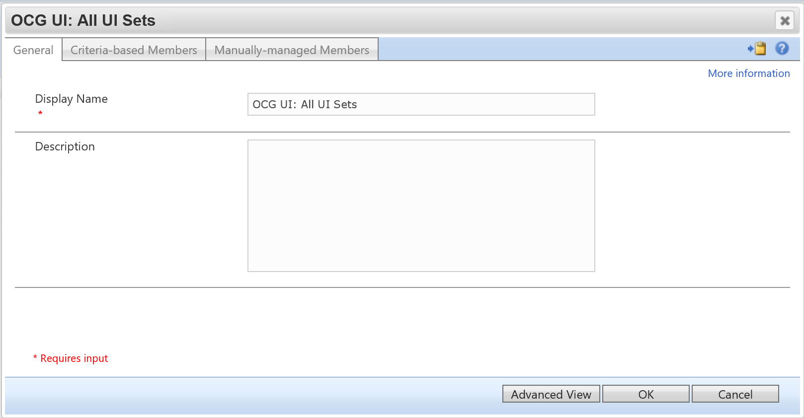
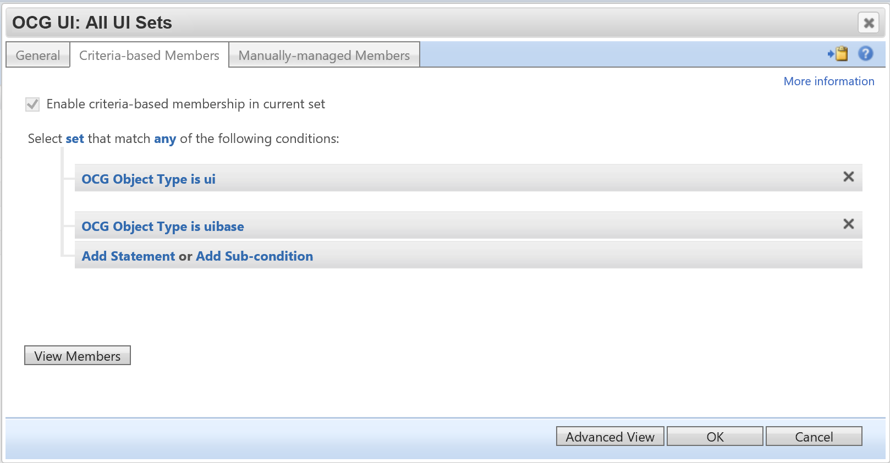

---
title: Installation Guide
permalink: /installation/
filename: installation.md
--- 

# Installation
Version: 4.2 or above

You can find all installation packages and tools in Teams unter OCGDE Technisch -> MIM UI -> Files -> OCG UI v4 -> Releases

## Prerequisites
- MIM Service and Portal (2016 R2 or later)
- [.Net Core 3.1 Hosting Bundle](https://dotnet.microsoft.com/download/dotnet/3.1)
- [IIS Rewrite Module (install through Web Platform Installer)](https://www.iis.net/downloads?tabid=34&g=6&i=1691)
- [Lithnet PowerShell Module](https://github.com/lithnet/resourcemanagement-powershell/wiki/Installing-the-module)
- MIMWAL Workflow (for backup workflow)

## Schema Extension
Add the following attributes and bindings in MIM Portal.
 
>Alternatively you can import the OCG Schema file (MIM2016R2SP1_SchemaOnly_ChangeSet_V2.xml), which already includes the schema extension.

 

| Attribute Name | System Name | Type | Multivalued | Bind to |
|--|--|--|--|--|
| OCG Configuration XML | ocgConfigurationXML | Unindexed string | No | Person, Set |
| OCG Admin View Sets | ocgAdminViewSetRefs | Reference | Yes | Person |
| OCG Primary View Set  | ocgPrimaryViewSetRef | Reference | No | Person |
| OCG Object Type | ocgObjectType | Indexed string | No | Set |
| OCG Object Scope | ocgObjectScope | Indexed string | No | Set |
| OCG Object Status | ocgObjectStatus | Indexed string | No | Set |
| OCG Object Source | ocgObjectSource | Indexed string | No | Set |
| OCG Is Active  | ocgIsActive | Boolean | No | Set |

>Administrators Set should have full access to OCG extension types and attributes. Additionally, ocgObjectType, ocgObjectStatus, ocgObjectScope and ocgObjectSource should be added to filter permissions

Make sure to run iisreset after extending schema

## Sets and MPRs
Add the following Sets and MPRs in MIM Portal
 
>Alternatively you can import the OCG Sets and MPRs file (MIM2016R2SP2_UISetsMPRs_ChangeSet.xml), which already includes the Sets and MPRs.

### Sets
- OCG UI: All UI Sets

|  |  |
|--|--|
- UI - Standard View

|  |  |
|--|--|

Input "uibase" in the "OCG Object Type" attribute
Copy the content of "ui-config-example.json" from the installation package in the the "OCG Configuration XML" attribute
>If you get a 10000 character limitation error, you can use the "importUISettings.ps1" to import the "ui-config-example.json" file

### MPRs
- OCG UI: Users can control UI attributes of their own

|  |  |
|--|--|

- OCG UI: Users can control UI Sets of their own

|  |  |
|--|--|

- OCG UI: Users can read UI Sets

|  |  |
|--|--|

- OCG UI: Users can read selected attributes of Sets, where they are a member of

|  |  |
|--|--|

## Backup Workflow for UI settings
>Refer to [Sets based UI Settings](/OCG-UI/Sets-based-UI-Settings) to learn how UI setting works. This section only shows how to deploy workflows to backup different UI settings

### Get [MIMWAL](https://github.com/microsoft/MIMWAL/wiki) version and token
Go to MIM Portal -> Administration -> All Resources -> Activity Information Configuration (AIC), open any MIMWAL AIC (display name starts with "WAL:") and write down the version number and the token displayed in the "Assembly Name" field.

### Get Micrsoft.ResourceManagement Version
Navigate to C:\Windows\Assembly and find the version number to the Microsoft.ResourceManagement library

|  |  |
|--|--|

### Import Backup Workflow
Open the file "UISettingBackup_ChangeSet.xml" from the installation package and replace !mimWalVersion!, !token! and !resourceManagementVersion! with the real data from the above steps.
Import this file into MIM Portal, you should get 4 new objects:
- OCG UI: Create ocgConfiguration Object for UISettingBackup
This is the Workflow for the backup process
- OCG UI: Create ocgConfiguration Object for UISettingBackup on ocgConfigurationXML change
This is the MPR for the backup process
- OCG UI: Backup Setting - Backup per Day
This is a configuration object of type ocgConfiguration, defines how many backups should be made for each UI Set every day. Default is 5
- OCG UI: Backup Setting - Days to Backup
This is a configuration object of type ocgConfiguration, defines how long the backups should be held in MIM Portal before they are expired and deleted. Default is 30

>After importing the backup workflow, a backup object of type ocgConfiguration will be created every time UI Setting is changed. The display name of the backup object has the format "UI Setting Backup - <UI Set Name> - <Created Time>"

## Publish OCG Data Service and OCG UI
>OCG UI v4.2 need the OCG Data Service v2.0.0 or above
1. Copy the OCGUI folder from the installation package to C:\inetpub
2. Add a website "OCGUI" in IIS with 8088 as port number, "C:\inetpub\OCGUI" as physical path and ".Net v4.5" as application pool
3. Convert "portal" to application
4. Enable "Anonymous Authentication" and "Windows Authentication" for "OCGUI" website
5. Enable "Anonymous Authentication" and "Windows Authentication" for "portal" application
>**In real production environment you may need additional settings in IIS like Host Name; Application Pool with Service Account, which has SPN registered; Negotiate only Authentication, etc.**

|  |  |
|--|--|
|  |  |

